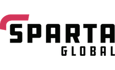

# Engineering 53 Final Project

## Task Brief

### Aims
to be able to run one command to spin up our architecture to serve our JS application. We will have our supporting pipelines working on Jenkins to automate the development. This project brings together all the training in the DevOps course and aims to produce three aspects.

This project comprises of a continuous Delivery pipeline that brings together your App Pipeline and Configuration Pipelines (There may be quite a few of these for Logstash, Elasticsearch, Kibana and Beats). Once we have had successful built these pipelines we should be able to trigger a manual build of our architecture i.e. terraform apply with the only change been the addition of new AMI's in the Terraform code if something has been changed in the App or Config. At this stage this enables us to have a barrier to release which can act as a Deployment check point.

### MultiAV Application

- Using Terraform and AWS we will create a load balanced and autoscaled 2 tier architecture for the node example application.
- The Architecture should be a "Highly Available" application, meaning that it has redundancies across all three availability zones.
- The application should connect to a single database instance in its availability zone.

### Replica Set

Our 2 tier architecture currently has a serious Single Point of Failure; the database tier.

We have previously run a single instance in a single availability zone. If this were to fail we would not only have down time but a serious loss of data.

We will create a replica set using mongo that allows three machines to replicate data and balance the load across three availability zones.

### Monitoring and Logs

Immutable architectures are notoriously difficult to debug because we no longer have access to the instances and thus do not have access to the logs for those machines.

Log consolidation allows us to have logs files broadcast to a central repository by the instances themselves which allows us to more easily view them.

The ELK stack is a commonly used system for this purpose. Elk is made up of Elastic Search, Logstash and Kibana - Also Beats.

We would like you to create an ELK stack that monitors the changes in the state of the Mongo Replica set. If one of the DB's goes down we should see this reflected in Kibana.

## Deliverables
- Link to all GitHub repositories for the project, they should all include a README.md that explains how to use the Repo with any dependancies included
	- Terraform repo
	- Application repo, including app cookbook and database cookbook repos
	- Packer repo
	- Logstash Configuration repo
	- Elasticsearch
	- Configuration repo
	- Kibana Configuraton repo
	- Beats Configuration repos
- Screen recoding of successful Pipeline jobs of Jenkins, this should include:-
	- Application Pipeline -> Test -> Merge -> Packer
	- Configuration Pipelines -> Test -> Merge
- Working Terraform script that if run sets up the entire architecture of the application/monitoring and sets up the app to viewed at the public IP
- Screen recording demonstrating the load balancing and autoscaling, this can be done by deleting instances on AWS and recording the results, showing self healing results
- Screen recording of ELK stack monitoring the Mongo replica set. If we delete the Mongo instances we should see this effect the dashboard in Kibana.
- Demonstrate effective use of Jira and Teams with constant updates and communication through the platform between the group

## Overview
Ensure terraform is installed on the jenkins slave node.
This repository contains the terraform code that will allow the user to run the command

````
terraform apply
````

This will create the environment for the app and database along with the security groups and VPCs required. They located in their own unique availability zones.
Three instances are made for the app as well as 3 for the database. The three databases contain one primary and two secondary databases which act as replica sets if the primary database goes down.
We have also added a load balancer that distributes the requests across the app instances equally as well as an autoscaler, that will create more instances when the instances meet its limits in loads.
In the terraform we have also added an ELK stack that monitors the vitals of the instances and creates a kibana page to view the statistics.

## Repositories

The first part of the CI/CD pipeline is the jenkins tests for the application and app and db cookbook repositories.
The unit tests and integration tests are done with chef commands (seen in individual repos).
If these tests pass, the branch is merged with the master.
After the branch is merged, an image is created from the app and db repositories using packer.
These are the linkes for application, app cookbook, database cookbook and packer.

Application:	   https://github.com/wizzchris/AppFolder

App cookbook:	   https://github.com/jemurphyuk/eng53-devops-final-app-cookbook

Database cookbook: https://github.com/jemurphyuk/eng53-devops-final-db-cookbook/blob/master/README.md

Packer for app/db: https://github.com/wizzchris/Engineering-53-DevOps-Final-Project-AppDB


For this terraform repository, the code is tested in jenkins by running these commands:
````
terraform init
terraform validate
````
We have also created jenkins jobs that creates images of the ELK stack. The repositories of each of the parks of the ELK stack are below.

Elastic search cookbook:	https://github.com/chpoullet/eng53-elasticsearch-cookbook

Logstash cookbook:		https://github.com/chpoullet/eng53-logstash-cookbook

Kibana cookbook:		https://github.com/chpoullet/eng53-kibana-cookbook

App filebeat/metric:		https://github.com/chpoullet/beats-app-cookbook

DB filebeat/metric:		https://github.com/chpoullet/beats-db-cookbook

packers repo for elk stack: 	https://github.com/chpoullet/eng53-elk-images

## Diagrams

This diagram shows the architecture we have created:


This diagram shows the pipelines we have created:



